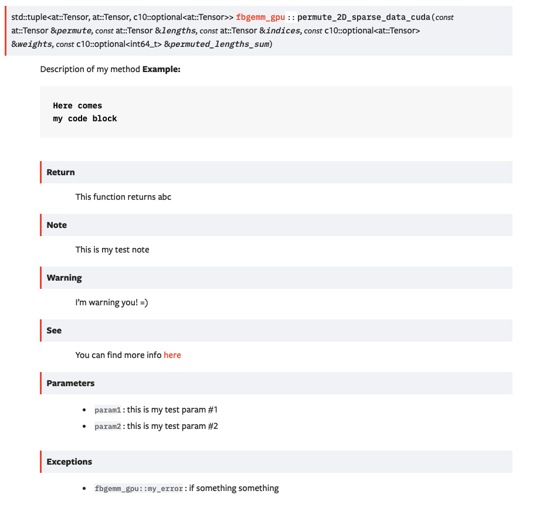

# FBGEMM_GPU Documentation

For a high-level overview of the design philosophy and brief descriptions of
various parts of FBGEMM_GPU, please see our Wiki (work in progress).

We have extensively used comments in our source files. The best and up-to-date
documentation is available in the source files.


## Building the API Documentation

`fbgemm_gpu` has both Python and C++ code. When you add new methods, functions,
you must add a description of what it is and what it does. We use Python
docstrings and C++ java style comments to document the code. Later the
documentation is generated with Sphinx and autodoc for Python and
Sphinx + Doxygen + Breathe for C++.

## General Guidelines

Here are the guidelines for all docstrings disregarding the language:

* Write docstrings together with the code. Don't leave this as a separate task.
* Code is not documentation! Put yourself in the shoes of a new developer who
  has to understand what your code does and make their life easier.
* At a very minimum, add:
    * A description of the method
    * A description for each argument that can be passed
    * Return value description
* Add usage examples, links to other methods, and limitations.

## Adding a new Docstring to the Python code

Add your PyThon docstrings to the `.py` files under the name of the methond.
Use [Google-style docstrings](https://www.sphinx-doc.org/en/master/usage/extensions/example_google.html).

Example:

```
def my_awesome_function():
    """
    This class is an example of how you can write docstrings.
    You can add multiple lines of those descriptions. Make sure to include
    useful information about your method.

    Args:
        arg1 (int): This is the first arg that you can pass with this function.

    Returns:
        This function returns X.

    Raises:
        AttributeError: This function raises an error.

    Example:
        This is how you can use this function

        >>> print("Code blocks are supported")

    Note:
       You can find more information
    """
```

Adding descriptions will not make them automatically published. Python modules
must be included to the corresponding `.rst` files.

To publish your docstrings:

1. Add the corresponding module method to
   [fbgemm_gpu.rst](./source/fbgemm_gpu.rst).
1. To preview locally, run `make html`.
1. Submit your PR and verify the Netlify preview.

## Adding a new description to the C++ code

We keep documentation in header files with the `.h` extension as well as in
`.cpp`, `cu`, and `cuh` files.
In these files files, everything between `#ifndef DOXYGEN_THIS_WILL_BE_SKIPPED` and
`#endif` will be hidden from the HTML output. At the moment, we hide
undocumented functions in these tags. When you add descriptions to a function,
make sure to set up the `#ifndef` and `#endif` are configured correctly.

All functions are grouped by a specific group for better organization. Make
sure you add `@defgroup` to the code comments.

Follow these instructions to document, generate, and publish a new C++ description:

1. Add a description to the source header file. At a very minimum, add a description
   verbatim, parameters by using the `@param` tag, and return value by using the
   @return tag. You can other tags as needed.
   Here is an example of how it can look:

   ```
   ///@defgroup my-group
   ///Description of my method <br>
   ///**Example:**
   ///```
   ///Here comes
   ///my code block
   ///```
   ///@param param1 this is my test param #1
   ///@param param2 this is my test param #2
   ///@return this function returns abc
   ///@note This is my test note
   ///@warning I'm warning you! =)
   ///@throw fbgemm_gpu::my_error if something something
   ///@see you can find more info <a href="https://www.doxygen.nl/manual/commands.html#cmdlink">here</a>
   ```

   This example generates the following HTML output:

   

1. Add a `doxygengroup` directive to your `.rst` file. If an `.rst` file for the
   corresponding header file does not exist, create a new
   one by the same name as the header file. If an `.rst` file already
   exists, make sure the `doxygengroup` is defined in that file. Example

   ```
   .. doxygengroup:: sparse-data-cuda
       :content-only:
   ```

1. Make sure your file is included in to the `toctree` in `docs/source/index.rst`.

1. You also need include your source header file to the `INPUT` parameter
   in the `Doxygen.ini` file. Most of the files are already included, but if
   your doc is not building, that's one place to check.

1. Build your docs:

   ```
   pip3 install -r requirements.txt
   doxygen Doxyfile.in
   make html
   ```

1. You can serve your docs locally with `sphinx-serve`:

   ```
   pip install sphinx-serve
   sphinx-serve -b build
   ```

1. Submit your PR and check the Netlify preview.
