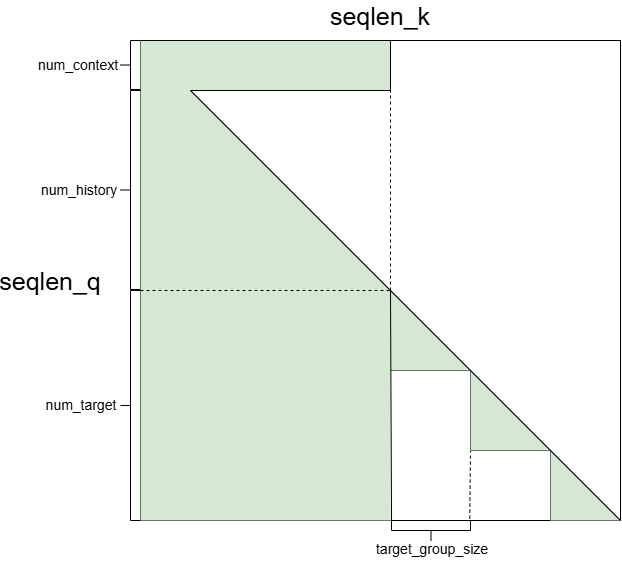
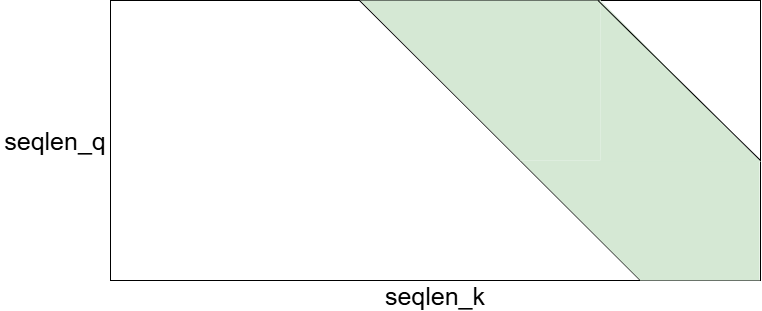
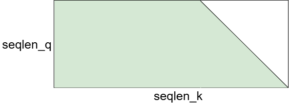

# FBGEMM HSTU

FBGEMM HSTU(Hierarchical Sequential Transduction Units)

# **1. Overview**

FBGEMM HSTU is a high-performance attention implementation for different NVIDIA GPU architectures:
- **HSTU-Ampere**: Runs on Ampere and Ada GPUs (A100, L20...)
- **HSTU-Hopper**: Optimized for Hopper GPUs (H100, H20...)

Both HSTU-2 and HSTU-3 share the same API:

```python
def hstu_attn_varlen_func(
    q,                      # (total_q, nheads, headdim)
    k,                      # (total_k, nheads_k, headdim), nheads should be equal to nhead_k
    v,                      # (total_k, nheads_k, headdim)
    seq_offsets_q,          # (batch_size + 1,), cumulative sequence lengths for q
    seq_offsets_k,          # (batch_size + 1,), cumulative sequence lengths for k/v
    max_seqlen_q,           # Maximum query sequence length
    max_seqlen_k,           # Maximum k/v sequence length
    num_contexts=None,      # (batch_size,), context tokens per batch
    num_targets=None,       # (batch_size,), target tokens per batch
    target_group_size=1,    # Number of target tokens per group
    window_size=(-1, -1),   # (left, right) for sliding window, -1 means infinite window size
    alpha=1.0,              # Scaling factor between add rab and silu
    rab=None,               # (batch_size, nhead_rab, max_seqlen_k, max_seqlen_k), relative attention bias
                            # nheads should be divisible by nhead_rab
    has_drab=False,         # Whether to apply drab
    is_delta_q=False,       # Whether to apply delta_q
    descale_q=None,         # (1,), descaling factor for query
    descale_k=None,         # (1,), descaling factor for key
    descale_v=None,         # (1,), descaling factor for value
    descale_do=None,        # (1,), descaling factor for do
)
```

**Note:** This function automatically detects the GPU architecture at runtime and dispatches to the appropriate implementation (HSTU-Ampere or HSTU-Hopper).


# **2. Installation**

```bash
cd fbgemm_gpu/

# Install HSTU-Ampere
python setup.py install --build-target=hstu -DTORCH_CUDA_ARCH_LIST="8.0"

# Install HSTU-Hopper
python setup.py install --build-target=hstu -DTORCH_CUDA_ARCH_LIST="9.0"

# Install both
python setup.py install --build-target=hstu -DTORCH_CUDA_ARCH_LIST="8.0 9.0"

# If you don't add -DTORCH_CUDA_ARCH_LIST, the default is "8.0 9.0".
```

# **3. Features**

### HSTU-Ampere
- **Supported GPUs**: Ampere, Ada, Hopper (without Hopper-specific features)
- **Data types**: FP16, BF16
- **Head dimensions**: 32, 64, 128, 256
- **Attention masks**:
  * No mask
  * Local mask (0 <= window_size_left < max_seqlen_k or 0 <= window_size_right < max_seqlen_k)
  * Causal mask (window_size_left = -1 and window_size_right = 0)
  * Context mask + causal mask
  * Target mask + causal mask
  * Context mask + causal mask + target mask

    
  * Delta_q ('seqlen_q <= seqlen_k')
  * Delta_q + local mask

    
  * Delta_q + causal mask

    

### HSTU-Hopper
- **Supported GPUs**: Hopper only (H100, H20)
- **Data types**: FP16, BF16 (forward and backward), FP8 (forward only)
- **Head dimensions**: 32, 64, 128, 256 for FP16/BF16; 64, 128, 256 for FP8
- **Attention masks**:
  * For FP16/BF16, same as HSTU-2
  * For FP8, only supports:
    + No mask
    + Causal mask
    + Local mask
- **Note**: Only undeterministic backward implementation
