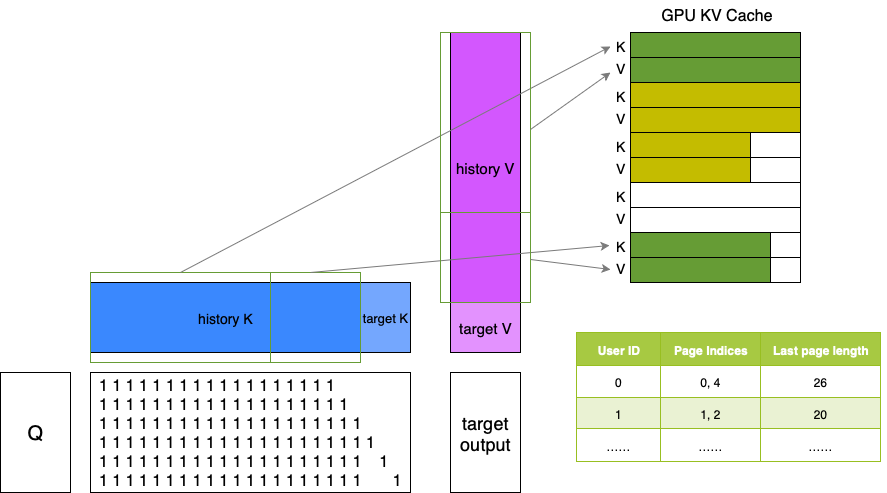
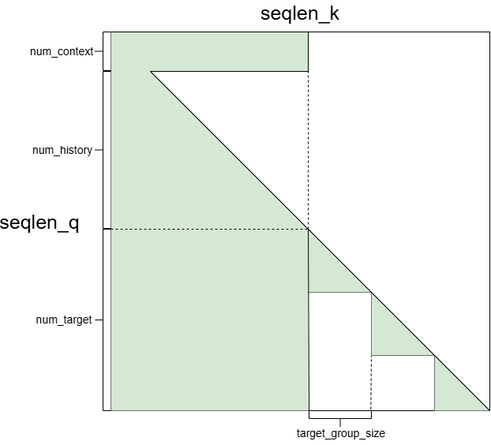
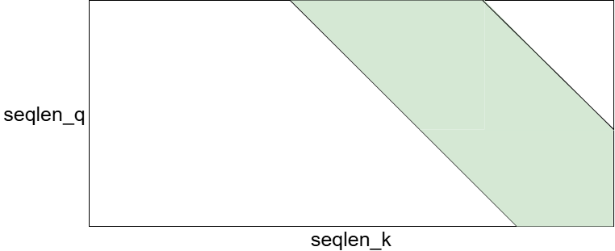
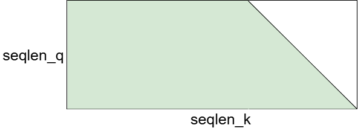

# FBGEMM HSTU

FBGEMM HSTU (Hierarchical Sequential Transduction Units)

# **1. Overview**

FBGEMM HSTU is a high-performance attention implementation for different NVIDIA GPU architectures:
- **HSTU-Ampere**: Runs on Ampere and Ada GPUs (A100, L20...)
- **HSTU-Hopper**: Optimized for Hopper GPUs (H100, H20...)

Both HSTU-2 and HSTU-3 share the same API:

```python
def hstu_attn_varlen_func(
    q,                     # (total_q, nheads, headdim)
    k,                     # (total_k, nheads_k, headdim), nheads should be equal to nhead_k
    v,                     # (total_k, nheads_k, headdim)
    cu_seqlens_q,          # (batch_size + 1,), cumulative sequence lengths for q
    cu_seqlens_k,          # (batch_size + 1,), cumulative sequence lengths for k/v
    seqused_q,             # (batch_size,). The number of valid tokens in each query sequence. If None, all tokens are valid.
    seqused_k,             # (batch_size,). The number of valid tokens in each key sequence. If None, all tokens are valid.
    max_seqlen_q,          # Maximum query sequence length
    max_seqlen_k,          # Maximum k/v sequence length
    num_contexts=None,     # (batch_size,), context tokens per batch
    num_targets=None,      # (batch_size,), target tokens per batch
    target_group_size=1,   # Number of target tokens per group
    window_size=(-1, -1),  # (left, right) for sliding window, -1 means infinite window size
    alpha=1.0,             # Scaling factor between add rab and silu
    rab=None,              # (batch_size, nhead_rab, max_seqlen_k, max_seqlen_k), relative attention bias
                           # nheads should be divisible by nhead_rab
    has_drab=False,        # Whether to apply drab
    kv_cache=None,         # (page_num, 2, page_size, nheads, headdim), key and value paged cache.
    page_offsets=None,     # (batch_size + 1,). The cumulative sequence lengths of the page_ptr in the batch, used to index into kv_cache.
    page_ids=None,         # (page_offsets[-1],). The ids of the pages in the batch.
    last_page_lens=None,   # (batch_size,). The lengths of the last pages in the batch.
    func=None,             # (nheads, total_q + 256). Function to describe the mask shape in arbitrary mask.
    quant_mode=-1,         # int. Quantization mode.
)
```

**Note:** This function automatically detects the GPU architecture at runtime and dispatches to the appropriate implementation (HSTU-Ampere or HSTU-Hopper).


# **2. Installation**

```bash
cd fbgemm_gpu/
git submodule update --init --recursive
pip install -r requirements.txt

# Install HSTU-Ampere
export HSTU_DISABLE_BACKWARD=FLASE; \
export HSTU_DISABLE_LOCAL=FALSE; \
export HSTU_DISABLE_CAUSAL=FALSE; \
export HSTU_DISABLE_CONTEXT=FALSE; \
export HSTU_DISABLE_TARGET=FALSE; \
export HSTU_DISABLE_ARBITRARY=FALSE; \
export HSTU_ARBITRARY_NFUNC=3; \
export HSTU_DISABLE_RAB=FALSE; \
export HSTU_DISABLE_DRAB=FALSE; \
export HSTU_DISABLE_BF16=FALSE; \
export HSTU_DISABLE_FP16=TRUE; \
export HSTU_DISABLE_HDIM32=FALSE; \
export HSTU_DISABLE_HDIM64=FALSE; \
export HSTU_DISABLE_HDIM128=FALSE; \
export HSTU_DISABLE_HDIM256=FALSE; \
export HSTU_DISABLE_DETERMINISTIC=TRUE; \
export HSTU_DISABLE_86OR89=TRUE; \
python setup.py install --build-target=hstu -DTORCH_CUDA_ARCH_LIST="8.0"

# Install HSTU-Hopper
export HSTU_DISABLE_BACKWARD=FALSE; \
export HSTU_DISABLE_LOCAL=FALSE; \
export HSTU_DISABLE_CAUSAL=FALSE; \
export HSTU_DISABLE_CONTEXT=FALSE; \
export HSTU_DISABLE_TARGET=FALSE; \
export HSTU_DISABLE_ARBITRARY=FALSE; \
export HSTU_ARBITRARY_NFUNC=3; \
export HSTU_DISABLE_RAB=FALSE; \
export HSTU_DISABLE_DRAB=FALSE; \
export HSTU_DISABLE_BF16=FALSE; \
export HSTU_DISABLE_FP16=TRUE; \
export HSTU_DISABLE_FP8=FALSE; \
export HSTU_USE_E5M2_BWD=FALSE; \
export HSTU_DISABLE_HDIM32=FALSE; \
export HSTU_DISABLE_HDIM64=FALSE; \
export HSTU_DISABLE_HDIM128=FALSE; \
export HSTU_DISABLE_HDIM256=FALSE; \
python setup.py install --build-target=hstu -DTORCH_CUDA_ARCH_LIST="9.0"

# Install both
export HSTU_DISABLE_BACKWARD=FALSE; \
export HSTU_DISABLE_LOCAL=FALSE; \
export HSTU_DISABLE_CAUSAL=FALSE; \
export HSTU_DISABLE_CONTEXT=FALSE; \
export HSTU_DISABLE_TARGET=FALSE; \
export HSTU_DISABLE_ARBITRARY=FALSE; \
export HSTU_ARBITRARY_NFUNC=3; \
export HSTU_DISABLE_RAB=FALSE; \
export HSTU_DISABLE_DRAB=FALSE; \
export HSTU_DISABLE_BF16=FALSE; \
export HSTU_DISABLE_FP16=TRUE; \
export HSTU_DISABLE_FP8=FALSE; \
export HSTU_USE_E5M2_BWD=FALSE; \
export HSTU_DISABLE_HDIM32=FALSE; \
export HSTU_DISABLE_HDIM64=FALSE; \
export HSTU_DISABLE_HDIM128=FALSE; \
export HSTU_DISABLE_HDIM256=FALSE; \
export HSTU_DISABLE_DETERMINISTIC=TRUE; \
export HSTU_DISABLE_86OR89=TRUE; \
python setup.py install --build-target=hstu -DTORCH_CUDA_ARCH_LIST="8.0 9.0"

# If you don't add -DTORCH_CUDA_ARCH_LIST, the default is "8.0 9.0".
# If you change any environment variables above, please run `python setup.py clean` and delete all *.cu files in src/hstu_hopper/instantiations/ and/or src/hstu_ampere/instantiations/ before compiling again.
```

# **3. Features**

### HSTU-Ampere
- **Supported GPUs**: Ampere, Ada, Hopper (without Hopper-specific features)
- **Data types**: FP16, BF16
- **Head dimensions**: 32, 64, 128, 256
- **Paged attention**:
  * Only support one mask shown in following figure.
  * Sequence length of each `k` and `v` is the same as `q`. So the first few items of `k` and `v` (which represent new history) are invalid, and the actual values of these elements are in the paged `kv_cache`.
  * Page size only supports 32 and 64.

  
- **Attention masks**:
  * No mask
  * Local mask (0 <= window_size_left < max_seqlen_k or 0 <= window_size_right < max_seqlen_k)
  * Causal mask (window_size_left = -1 and window_size_right = 0)
  * Context mask + causal mask
  * Target mask + causal mask
  * Context mask + causal mask + target mask

    
  * Delta_q (seqlen_q < seqlen_k would automatically use delta_q)
  * Delta_q + local mask

    
  * Delta_q + causal mask

    

  * Arbitrary mask

    Use array to determine the mask situation for each row of S. We provide three examples, please refer to [line 398](test/hstu_test.py#L398), [line 430](test/hstu_test.py#L430), and [line 463](test/hstu_test.py#L463) of hstu_test.py.

### HSTU-Hopper
- **Supported GPUs**: Hopper only (H100, H20)
- **Data types**: FP16, BF16, and FP8
- **Head dimensions**: 32, 64, 128, 256 for FP16/BF16; 64, 128, 256 for FP8
- **Attention masks**: Same as HSTU-Ampere
- **Quantization mode**: Five modes.
  * quant_mode == 0: Cast to fp8 directly.
  * quant_mode == 1: 1xDIM && 128x1.
  * quant_mode == 2: Per block quantization. Block size is in [get_bm_and_bn_block_size_fwd](hstu/cuda_hstu_attention.py#L93) and [get_bm_and_bn_block_size_bwd](hstu/cuda_hstu_attention.py#L112).
  * quant_mode == 3: Per head quantization. Shape of q_descale is (batch_size, nheads).
  * quant_mode == 4: Per batch quantization. Shape of q_descale is (batch_size).
  * quant_mode == 5: Per tensor quantization. Shape of q_descale is (1).
- **Note**: Only undeterministic backward implementation
